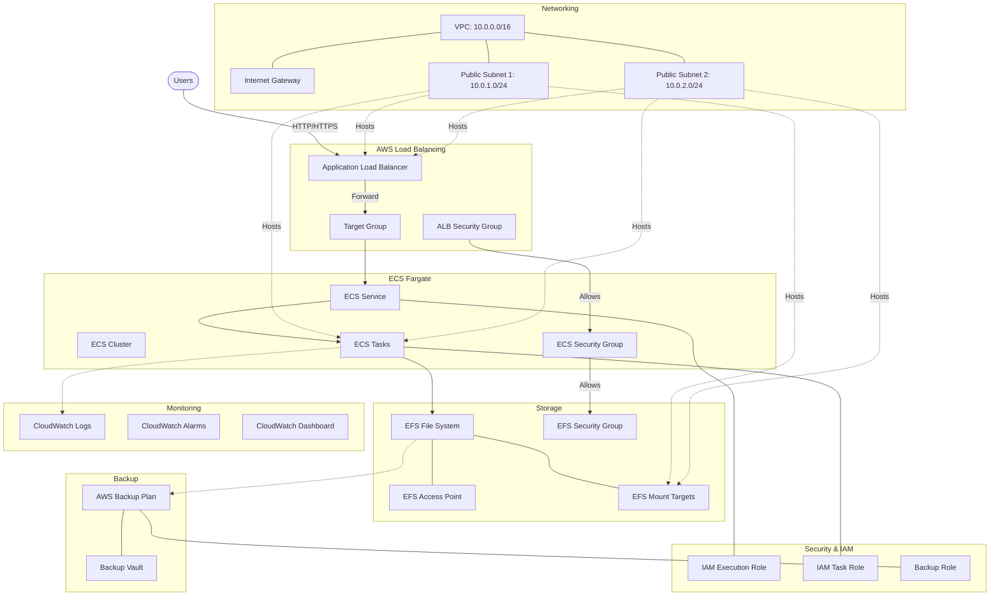

# ChangeDetection.io Infrastructure Documentation

## Infrastructure Architecture Diagram

## Infrastructure Details

### Networking
- **VPC**: CIDR 10.0.0.0/16
- **Public Subnets**: 2 subnets across different AZs
- **Internet Gateway**: For public internet access

### Compute
- **ECS Cluster**: Runs on AWS Fargate (serverless)
- **ECS Service**: Maintains desired task count
- **Container**: ChangeDetection.io application

### Storage
- **EFS File System**: Persistent storage for application data
- **Mount Targets**: In both public subnets
- **Daily Backups**: Using AWS Backup

### Security
- **ALB Security Group**: Allows HTTP on port 5000 from whitelisted IPs
- **ECS Security Group**: Permits traffic only from the load balancer
- **EFS Security Group**: Allows NFS traffic from ECS tasks
- **IAM Roles**: Least privilege permissions for each component

### Load Balancing
- **Application Load Balancer**: Distributes traffic to ECS tasks
- **Target Group**: With health checks to ensure application availability
- **HTTP Listener**: On port 80 (with potential for HTTPS configuration)

### Monitoring
- **CloudWatch Logs**: For container log management
- **CloudWatch Dashboard**: With CPU and memory metrics
- **CloudWatch Alarms**: For high resource utilization

## Key Design Elements
- **High Availability**: Resources deployed across multiple AZs
- **Security**: Layered security with specific network rules
- **Data Persistence**: EFS with backup for data durability
- **Scalability**: ECS services can scale based on demand